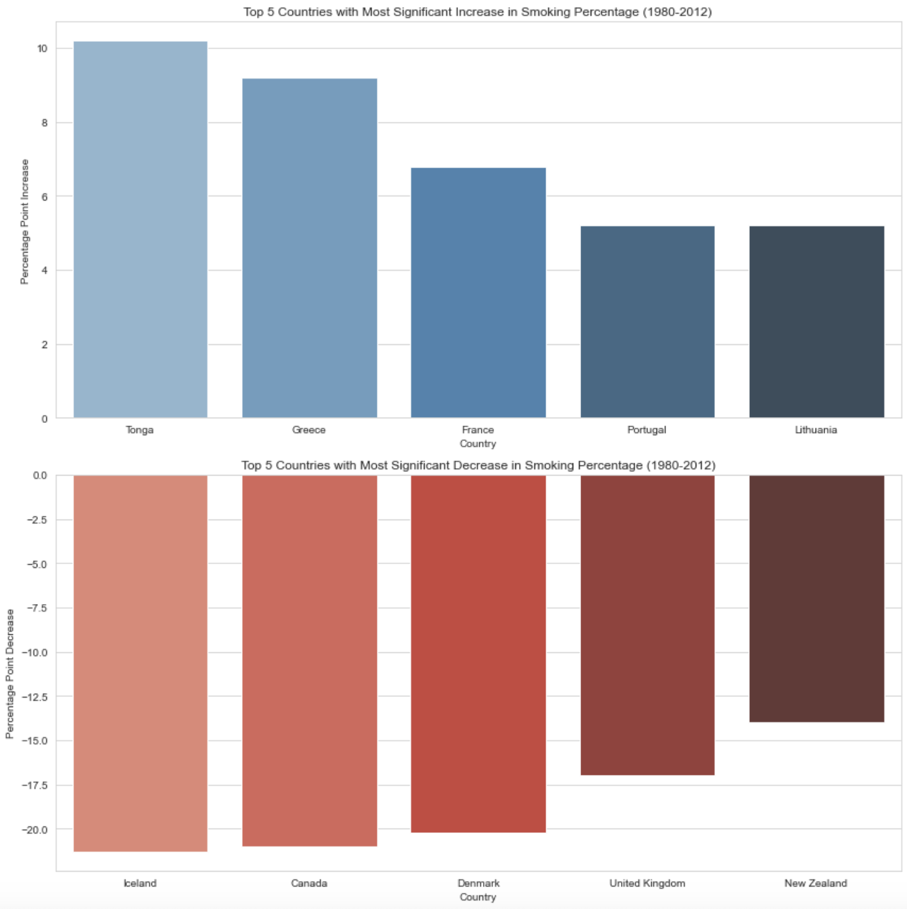
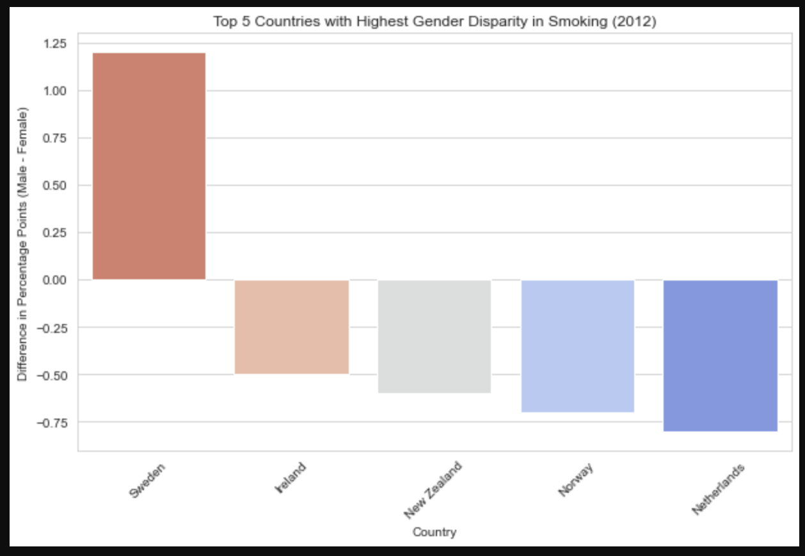
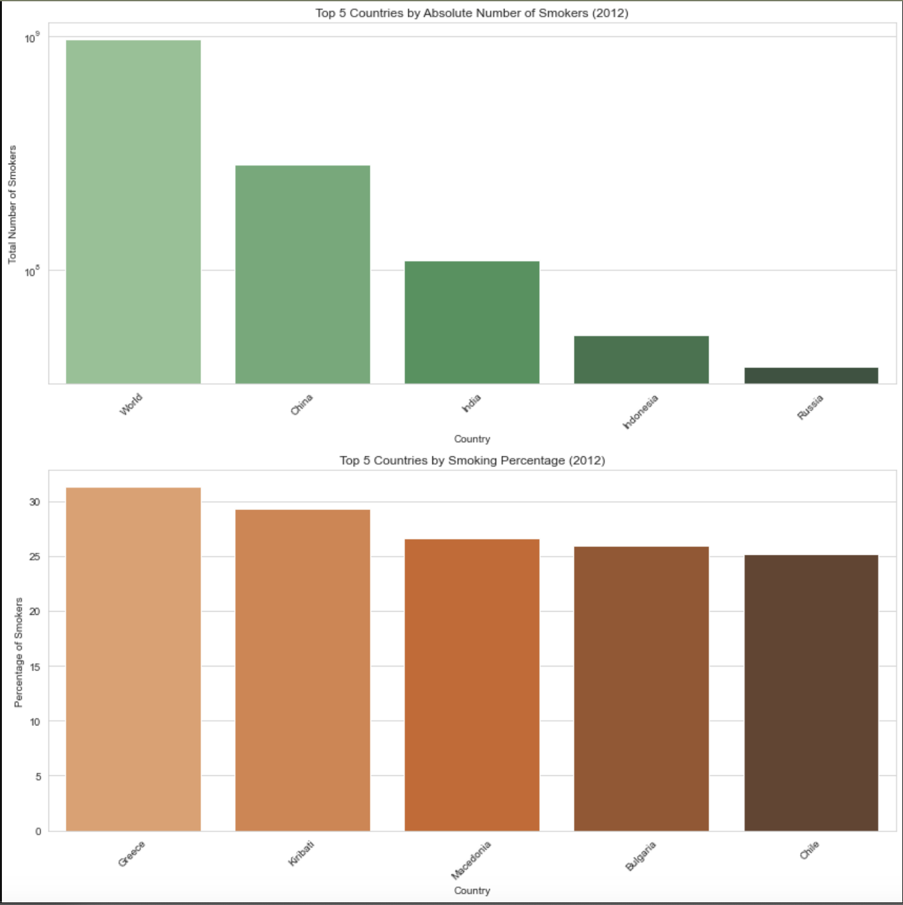

---

# Smoking Trends Analysis (1980-2012)

This repository contains an in-depth analysis of smoking trends across various countries from 1980 to 2012. The dataset provides insights into the daily cigarette consumption, gender-specific smoking percentages, and total smokers by country over the years.

## Key Findings:

### 1. **Trend Analysis**:
- **Countries with the Most Significant Increase**:
  - **Tonga**: Increased by approximately 10.2 percentage points.
  - **Greece**: Increased by approximately 9.2 percentage points.
  - **France**: Increased by approximately 6.8 percentage points.
  
- **Countries with the Most Significant Decrease**:
  - **Iceland**: Decreased by approximately 21.3 percentage points.
  - **Canada**: Decreased by approximately 21.0 percentage points.
  - **Denmark**: Decreased by approximately 20.2 percentage points.

### 2. **Gender Disparity Analysis (2012)**:
- **Sweden**: Male smokers exceed female smokers by approximately 1.2 percentage points.
- **Ireland**: Female smokers exceed male smokers by approximately 0.5 percentage points.

### 3. **Intensity Analysis (2012)**:
- **Suriname**: Individuals smoke approximately 108.9 cigarettes daily on average.
- **Saint Vincent and the Grenadines**: Approximately 81.6 cigarettes daily.

### 4. **Absolute Numbers vs. Percentage Analysis (2012)**:
- **China** has the highest number of smokers at approximately 281.7 million.
- **Greece** has the highest percentage of smokers, with 31.3% of the population smoking.
  

## Visualizations:
The repository contains various visualizations that provide insights into the data and our findings. These charts are crafted carefully to ensure clarity and accuracy.

## Dataset:
The dataset used for this analysis is `smoking.csv`, which contains detailed data about smoking habits across countries from 1980 to 2012.

## How to Use:
1. Clone the repository.
2. Navigate to the directory.
3. Open the Jupyter Notebook or Python script to view the analysis.

---
